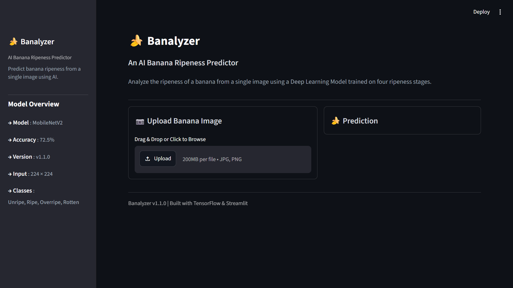
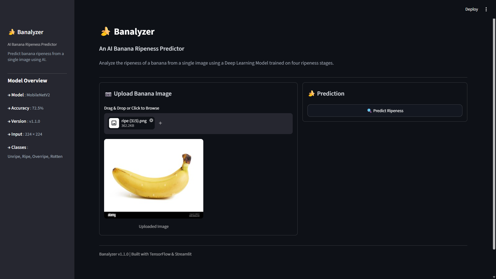
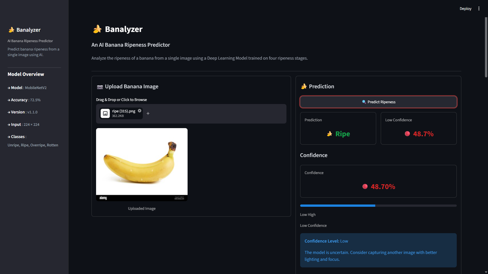
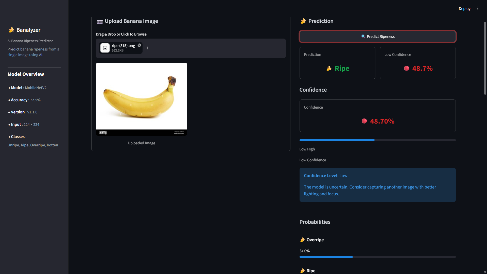
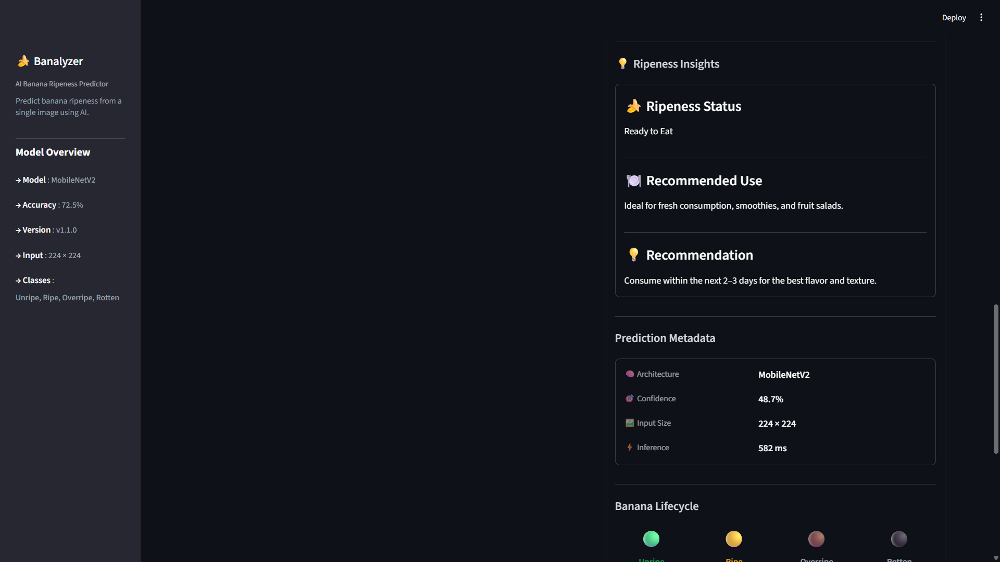
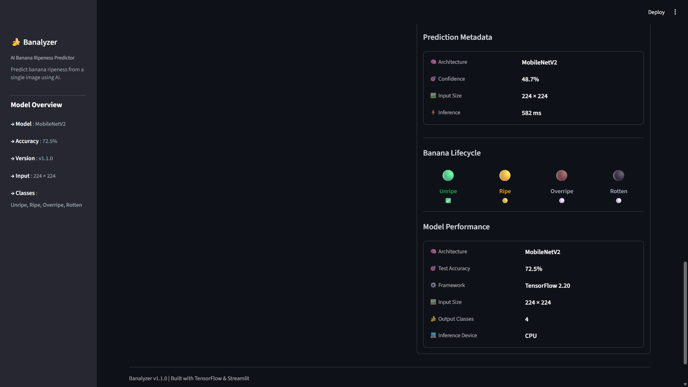
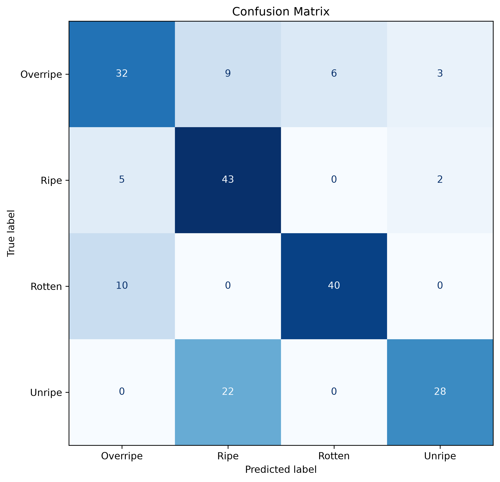

<h1 align="center">🍌 Banalyzer</h1>

<p align="center">
  <strong>AI-Powered Banana Ripeness Classification</strong>
</p>

<p align="center">
Production-inspired Deep Learning application built with TensorFlow, MobileNetV2, and Streamlit.
</p>

<p align="center">
Computer Vision • Transfer Learning • Streamlit • TensorFlow • MobileNetV2
</p>

---

Banalyzer is a production-inspired computer vision application that classifies banana ripeness from a single image using a MobileNetV2-based deep learning model.

The application predicts one of four ripeness stages:

- 🍃 Unripe
- 🍌 Ripe
- 🟤 Overripe
- ⚫ Rotten

Developed as an end-to-end machine learning project, Banalyzer demonstrates the complete AI workflow, including data preparation, transfer learning, model evaluation, inference, deployment, and software engineering best practices.

Beyond model performance, the project emphasizes modular architecture, centralized configuration, structured logging, reusable inference pipelines, and maintainable code organization, reflecting practices commonly used in production-oriented AI systems.


---


[](https://banana-ripeness-predictor.streamlit.app) 


  


## 📊 Project Snapshot

| Property | Value |
|----------|-------|
| **Version** | v1.1.0 |
| **Project Type** | Deep Learning Image Classification |
| **Domain** | Computer Vision |
| **Framework** | TensorFlow 2.20 |
| **Model** | MobileNetV2 (Transfer Learning) |
| **Programming Language** | Python 3.13 |
| **Classes** | 4 (Unripe, Ripe, Overripe, Rotten) |
| **Test Accuracy** | 72.5% |
| **Deployment** | Streamlit Cloud |
| **License** | MIT |


## 🌐 Live Demo

Try Banalyzer directly in your browser. No installation or setup required.

🚀 **Launch Banalyzer**

https://banana-ripeness-predictor.streamlit.app

> Upload a banana image and receive a ripeness prediction powered by a MobileNetV2 deep learning model.

### What you can explore

- Upload banana images
- AI-powered ripeness classification
- Confidence score and probability distribution
- Ripeness insights and recommendations
- Interactive Streamlit dashboard

The application is publicly deployed on Streamlit Cloud and can be accessed from any modern web browser.


## Table of Contents

- [🌐 Live Demo](#-live-demo)
- [📖 Overview](#overview)
- [💡 Why Banalyzer?](#-why-banalyzer)
- [✨ Features](#features)
- [🏗️ Engineering Highlights](#️-engineering-highlights)
- [🧠 Design Decisions](#design-decisions)
- [🛠️ Technology Stack](#technology-stack)
- [🏛️ Project Architecture](#project-architecture)
- [📂 Repository Structure](#repository-structure)
- [📚 Project Documentation](#-project-documentation)
- [📸 Application Preview](#application-preview)
- [📈 Model Performance](#model-performance)
- [📦 Dataset](#dataset)
- [⚙️ Installation](#installation)
- [🚀 Usage](#usage)
- [🔮 Future Improvements](#future-improvements)
- [🙏 Acknowledgements](#acknowledgements)
- [👨‍💻 Author](#author)
- [📄 License](#license)


# Overview

Banalyzer is a production-inspired deep learning application that classifies banana ripeness from a single image using a MobileNetV2 model trained with Transfer Learning.

Built with TensorFlow and deployed through Streamlit, the project demonstrates an end-to-end computer vision workflow, from dataset preparation and model training to evaluation, inference, and interactive deployment.

Beyond image classification, Banalyzer focuses on software engineering practices that improve maintainability and scalability. The codebase follows a modular architecture with centralized configuration, reusable inference pipelines, structured logging, and a clear separation of responsibilities across training, evaluation, prediction, and presentation layers.

The repository showcases how machine learning and software engineering can be combined to build an AI application that is both technically robust and ready to be shared, maintained, and extended.


# Why Banalyzer?

Many machine learning projects end once a model achieves satisfactory accuracy. Banalyzer was built to demonstrate that a successful AI project extends far beyond model training.

The project showcases the complete lifecycle of a production-inspired computer vision application, covering data preparation, transfer learning, model evaluation, inference, deployment, and user interaction through an intuitive web interface.

Rather than focusing solely on predictive performance, Banalyzer emphasizes software engineering principles such as modular architecture, reusable components, centralized configuration, structured logging, comprehensive documentation, and maintainable code organization.

The result is a repository that demonstrates not only how to build a deep learning model, but also how to transform that model into a structured, deployable, and extensible software application.


# Features

### AI Capabilities

- MobileNetV2-based image classification using Transfer Learning
- Predicts four ripeness stages:
  - 🟢 Unripe
  - 🟡 Ripe
  - 🟤 Overripe
  - ⚫ Rotten
- Confidence score for every prediction
- Probability distribution across all classes
- Human-readable prediction explanation

---

### Application Features

- Upload banana images (JPG / PNG)
- Interactive Streamlit dashboard
- Ripeness insights and recommendations
- Prediction metadata and model information

---

### Engineering Highlights

- Modular project architecture
- Centralized configuration
- Reusable inference pipeline
- Image validation before inference
- Production-inspired project organization


# Engineering Highlights

- Modular software architecture with clear separation of concerns
- MobileNetV2 Transfer Learning pipeline for efficient image classification
- Image validation before inference to improve prediction reliability
- Reusable prediction pipeline shared across the application
- Centralized configuration management for maintainability
- Structured logging for easier debugging and monitoring
- Interactive Streamlit dashboard with a clean user interface
- Comprehensive technical documentation
- Production-inspired project organization


# Design Decisions

Banalyzer was designed as more than a machine learning experiment. It was developed as a structured application that follows software engineering principles while demonstrating a complete end-to-end AI workflow.


### MobileNetV2

MobileNetV2 was selected for its strong balance between classification performance, inference speed, and computational efficiency. Its lightweight architecture enables fast predictions while maintaining competitive accuracy, making it well suited for interactive web applications and deployment on resource-constrained environments.


### Transfer Learning

Training a deep neural network from scratch requires a large labeled dataset and significant computational resources. By leveraging Transfer Learning, Banalyzer builds upon visual features learned from ImageNet, enabling faster convergence, improved generalization, and efficient adaptation to the banana ripeness classification task.


### Streamlit

Streamlit was chosen to provide a lightweight and interactive interface for model inference. It enables rapid deployment of machine learning applications, allowing users to upload images, generate predictions, and explore results without requiring knowledge of Python or machine learning workflows.


### Modular Architecture

The project separates responsibilities into dedicated modules for configuration, training, evaluation, prediction, validation, and presentation. This separation of concerns improves readability, maintainability, testability, and scalability while making future enhancements easier to implement.


## Production-Inspired Engineering Practices

The repository follows several software engineering best practices, including:

- Centralized configuration management
- Modular project structure
- Reusable prediction pipeline
- Structured logging
- Type hints
- Separation of concerns
- Production-style folder organization


##  Technology Stack

| Category | Technology |
|----------|------------|
| Programming Language | Python 3.13 |
| Deep Learning Framework | TensorFlow 2.20 |
| Model Architecture | MobileNetV2 (Transfer Learning) |
| Computer Vision | OpenCV, Pillow |
| Data Processing | NumPy, Pandas |
| Data Visualization | Matplotlib |
| Web Framework | Streamlit |
| Machine Learning Utilities | Scikit-learn |
| Version Control | Git & GitHub |
| Model Format | `.keras` |
| Development Environment | VS Code |


# Project Architecture

```text
                        User Upload
                             │
                             ▼
                 Image Validation Layer
                             │
                             ▼
                Image Preprocessing Layer
                             │
                             ▼
          MobileNetV2 (Transfer Learning)
                             │
                             ▼
                  Prediction Pipeline
                             │
             ┌───────────────┼───────────────┐
             ▼               ▼               ▼
      Confidence Score  Probability      Prediction
                         Distribution     Explanation
             └───────────────┼───────────────┘
                             ▼
              Ripeness Insights & Metadata
                             │
                             ▼
              Interactive Streamlit Dashboard
```


# Repository Structure

```text
Banalyzer/
│
├── assets/                     # Images, screenshots, and UI assets
├── data/                       # Dataset (download separately)
├── docs/                       # Project documentation
├── models/                     # Trained model and class mapping
├── outputs/                    # Evaluation results and generated artifacts
├── utils/                      # Utility and helper modules
│
├── app.py                      # Streamlit application entry point
├── config.py                   # Centralized project configuration
├── predict.py                  # Reusable prediction pipeline
├── train.py                    # Model training pipeline
├── evaluate.py                 # Model evaluation pipeline
│
├── requirements.txt            # Project dependencies
├── LICENSE                     # MIT License
└── README.md                   # Project documentation
```


# Project Documentation

In addition to this README, Banalyzer includes dedicated technical documentation covering the project's architecture, dataset preparation, model development, deployment, testing, and known limitations.

| Document | Purpose |
|----------|---------|
| `architecture.md` | System architecture and key design decisions |
| `dataset.md` | Dataset organization, preprocessing, and augmentation |
| `model.md` | Training methodology, configuration, and model details |
| `deployment.md` | Local deployment and application setup |
| `testing/manual_test_matrix.md` | Manual testing scenarios and expected outcomes |
| `testing/validation_summary.md` | Validation process and testing results |
| `testing/known_limitations.md` | Current limitations and planned improvements |


# Application Walkthrough

## Home Dashboard

The home dashboard introduces Banalyzer, presents key project information, and provides the entry point for image upload and prediction.

<p align="center">
  
</p>

---

## Upload & Prediction

Users can upload a banana image in JPG or PNG format and initiate inference through the interactive Streamlit interface.

<p align="center">
  
</p>

---

## Prediction Result

The prediction panel presents the detected ripeness stage together with the model's confidence score and inference summary.

<p align="center">
  
</p>

---

## Confidence Analysis

Confidence analysis visualizes prediction certainty across all ripeness classes, helping users better understand the model's decision.

<p align="center">
  
</p>

---

## Ripeness Insights

Beyond classification, Banalyzer provides contextual ripeness insights and practical recommendations based on the predicted stage.

<p align="center">
  
</p>

---

## Model Performance Dashboard

The dashboard summarizes inference metadata together with key model information, providing additional transparency into the prediction process.

<p align="center">
  
</p>


# Model Performance

## Test Results

| Metric | Value |
|---------|-------|
| Model Architecture | MobileNetV2 |
| Learning Strategy | Transfer Learning |
| Test Accuracy | **72.5%** |
| Number of Classes | **4** |
| Input Resolution | **224 × 224** |
| Framework | TensorFlow 2.20 |
| Deployment | Streamlit Cloud |

---

## Training History

The training history illustrates the progression of training and validation accuracy and loss throughout the learning process, providing insight into model convergence and generalization.

<p align="center">
  
</p>

---

## Confusion Matrix

The confusion matrix provides a class-wise view of model performance, highlighting correctly classified samples as well as common areas of confusion between visually similar ripeness stages.

<p align="center">
  
</p>


### Key Observations

- The model performs strongest on the **Ripe** and **Rotten** classes.
- Most misclassifications occur between **Unripe** and **Ripe**, reflecting the gradual visual transition between adjacent ripeness stages.
- Overall, the confusion matrix demonstrates that the model captures meaningful visual patterns while also highlighting opportunities for improvement through additional data, augmentation, or further fine-tuning.


## Model Limitations

Current limitations include:

- Performance depends on image quality and lighting conditions.
- Predictions are optimized for single-banana images.
- Transitional ripeness stages remain the most challenging to classify.
- Additional training data could further improve model generalization.


# 📦 Dataset

Banalyzer is trained on a publicly available banana ripeness image dataset containing four ripeness categories:

- 🍃 Unripe
- 🍌 Ripe
- 🟤 Overripe
- ⚫ Rotten

The dataset is **not included** in this repository because of its size and licensing considerations.

To reproduce the training pipeline:

1. Download the dataset from the source below.
2. Extract it into the `data/` directory.
3. Follow the training instructions provided in the documentation.

> **Dataset Source:** Kaggle Banana Ripeness Dataset

The repository structure assumes the dataset is organized under:

```text
data/
├── train/
├── validation/
└── test/
```

# Installation

Follow the steps below to run Banalyzer locally.

## 1. Prerequisites

Before running Banalyzer, ensure you have:

- Python 3.13 or later
- Git
- pip

## 2. Clone the Repository

Clone the project locally:

```bash
git clone https://github.com/Shivv-Dev/Banalyzer.git
cd Banalyzer
```

## 3. Create a Virtual Environment

### Windows

```bash
python -m venv .venv
.venv\Scripts\activate
```

### macOS / Linux

```bash
python3 -m venv .venv
source .venv/bin/activate
```

## 4. Install Dependencies

Install all required Python dependencies:

```bash
pip install -r requirements.txt
```

## 5. Run the Application

```bash
streamlit run app.py
```

If the browser does not open automatically, navigate to:

```
http://localhost:8501
```


# Usage

Using Banalyzer is straightforward:

1. Launch the Streamlit application.
2. Upload a banana image in JPG or PNG format.
3. Click **Predict Ripeness**.
4. Review the generated prediction dashboard.

The application provides:

- Predicted ripeness stage
- Confidence score
- Probability distribution
- Prediction explanation
- Ripeness insights
- Inference metadata
- Model performance summary


# Future Improvements

### Model Improvements

- [ ] Grad-CAM visualization for explainable AI
- [ ] Performance benchmarking across model architectures
- [ ] Automated model retraining pipeline
- [ ] Model versioning

---

### 🌐 Application Features

- [ ] Batch image prediction
- [ ] Real-time webcam inference
- [ ] REST API using FastAPI

---

### DevOps & Deployment

- [ ] Docker containerization
- [ ] CI/CD with GitHub Actions
- [ ] Cloud deployment


# Acknowledgements

Banalyzer builds upon several outstanding open-source projects that make modern machine learning development possible.

Special thanks to the communities behind:

- TensorFlow
- Streamlit
- OpenCV
- Pillow
- NumPy
- Matplotlib
- Scikit-learn

Their contributions to the open-source ecosystem made this project possible.


# Author

**Shiva Poojith Alli**

Machine Learning • Computer Vision • Python • Software Engineering

I'm passionate about building AI-powered applications that combine machine learning with clean software engineering practices.

- GitHub: ...
- LinkedIn: ...

If you enjoyed this project, feel free to connect or explore my other work.


# License

This project is licensed under the MIT License.

See the [LICENSE](LICENSE) file for more information.


---

If you found this project interesting,
consider giving it a ⭐ on GitHub.

Feedback, suggestions, and contributions are always welcome.

Built with ❤️ using Python, TensorFlow, and Streamlit.
